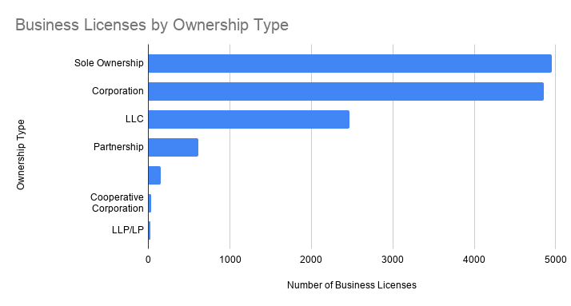
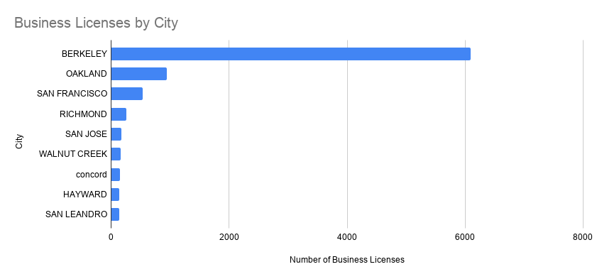

# Rental Property and Construction Lead Berkeley Business Licenses

## Introduction
I chose the City of Berkeley Business Licenses dataset. It shows that both rental property and construction businesses make up the largest share of business licenses in the city. To better understand these patterns, I analyzed the dataset in Google Sheets using pivot tables and bar charts. I created four pivot tables and three bar charts to compare business types, ownership types, and the cities listed in the dataset. Based on my analysis, rental property, construction, and professional services appeared most often for business types, while sole ownership and corporation were the most common ownership types.

## Data Source
I used the City of Berkeley Business Licenses dataset from the City of Berkeley Open Data Portal. The dataset includes information about licensed businesses, including business type, ownership type, city, and employee count. I downloaded the data as a CSV file and imported it into Google Sheets so I can organize and analyze the data.

## Data Analysis
I analyzed the dataset in Google Sheets using pivot tables. I counted business licenses by business type, ownership type, city, and employee count. I used the pivot tables to create three bar charts that compare the different categories I used.

### Chart 1: Business Licenses by Business Type

*Figure 1.* Rental property licenses were the largest business category in the dataset. Then it was followed by construction and professional services. These three business types appeared much more often than the other categories. So based on the dataset, they make up a large part of licensed businesses in Berkeley.
**Source:** [City of Berkeley Open Data Portal](https://data.cityofberkeley.info/Business/Business-Licenses/rwnf-bu3w/about_data)

### Chart 2:  Business Licenses by Ownership Type

*Figure 2.* Sole ownership and corporations were the two most common ownership types in the dataset. LLCs were also common, but they appeared way less often than sole ownerships and corporations. Partnerships and the remaining ownership types made up only a small portion of the business licenses in the dataset.
**Source:** [City of Berkeley Open Data Portal](https://data.cityofberkeley.info/Business/Business-Licenses/rwnf-bu3w/about_data)

### Chart 3: Business License by City

*Figure 3.* Berkeley had the largest number of business licenses in the dataset by a wide margin. Oakland and San Francisco came after, but they had way fewer business licenses than Berkeley. The other remaining cities each had small numbers of business licenses compared with the top three cities.
**Source:** [City of Berkeley Open Data Portal](https://data.cityofberkeley.info/Business/Business-Licenses/rwnf-bu3w/about_data)

## Methods
I imported the City of Berkeley Business Licenses dataset into Google Sheets as a CSV file. Then I create four pivot tables so I can organize the data and count business licenses by business type, ownership type, city, and employee count. I then created three bar charts from the pivot tables to help compare the different categories and better understand the patterns in my dataset.

## Methods and Limitations
This dataset shows information about business licenses, but it doesn't explain why some business types or ownership types are more common than others. It also doesn’t include information about whether businesses are successful, how much money they earn, or whether the licenses are still active. Because of this, the charts only show patterns in the data and shouldn’t be used to make conclusions beyond what’s included in the dataset since there isn’t enough information.

## Ethical Considerations
It’s important not to assume about individual businesses based on this dataset. The charts only summarize business licenses and don’t provide information about things like the people who own the businesses or how they work. If this dataset were used in a news story, I would want to include more reporting or interviews to better understand the reasons behind the patterns shown in the data.

## Conclusion
This project honestly helped me better understand the types of businesses that hold licenses in Berkeley. Rental property, construction, and professional services appeared most often, while sole ownerships and corporations were the most common ownership types. Even though the dataset showed some interesting patterns, it also showed me that data has limits. So to better understand these datasets, the more information before making any conclusions, the better.

## Sources
**Original Dataset:** [Business Licenses](https://data.cityofberkeley.info/Business/Business-Licenses/rwnf-bu3w/about_data)
**Google Sheets Analysis:** [Google Sheets](https://docs.google.com/spreadsheets/d/10Lq0eV2Z7D4U0tAw_0sV8sl2jFtskmWt9g2cRPwrpDs/edit?usp=sharing)

