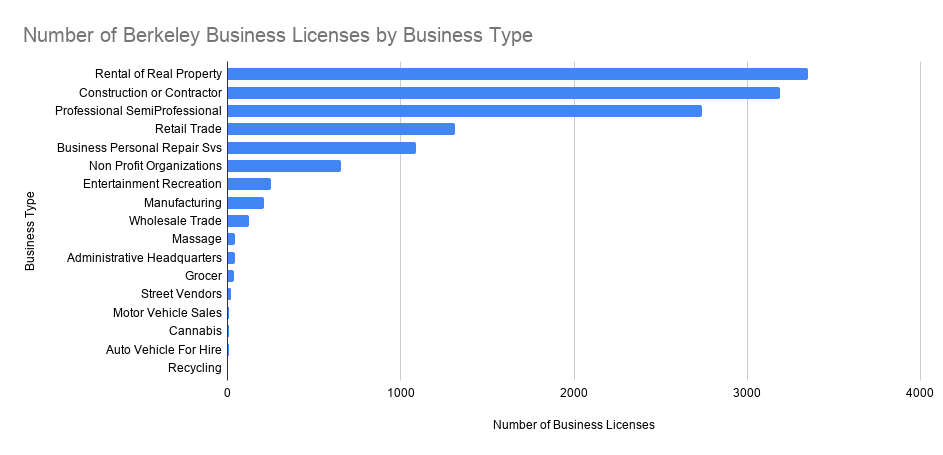

# Rental Property and Construction Lead Berkeley Business Licenses

## Introduction
I chose the City of Berkeley Business Licenses dataset. It shows that rental property and construction businesses make up the largest share of business licenses in the city. To better understand these patterns, I analyzed the dataset in Google Sheets using pivot tables and bar charts. I created 4 pivot tables and bar charts to compare business types, ownership types, and the cities listed in the dataset. Based on my analysis, rental property, construction, and professional services appeared most often for business types, while sole ownership and corporation were the most common ownership types.

## Data Source
I used the City of Berkeley Business Licenses dataset from the City of Berkeley Open Data Portal. The dataset includes information about licensed businesses, including business type, ownership type, city, and employee count. I downloaded the data as a CSV file and imported it into Google Sheets so I can organize and analyze the data.

## Data Analysis
I analyzed the dataset in Google Sheets using pivot tables. I counted business licenses by business type, ownership type, city, and employee count. I used the pivot tables to create three bar charts that compare the different categories I used.

## Chart 1: Business Licenses by Business Type

